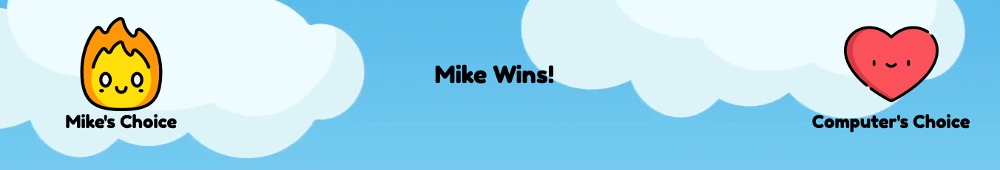

# Cartoon Rock Paper Scissors
#### Description
Take a gander against a computer in a classic rock paper scissors game or an elemental version with a special twist.

#### Getting Started
To clone to your local machine please follow these steps:
1. Copy the SSH
2. In the terminal run the following commands:
```
git clone git@github.com:michaelputnam67/rock-paper-scissors.git
cd rock-paper-scissors
open index.html
```
3. On the load screen you will see a Form. Input a name of your choice and toggle through some animal avatars! When you are ready press the Generate Player button. 

#### Dependencies
The project is not live so you will need to open it on your local computer

#### Execution
##### Home Screen
- After filling out the form you will be taken to a home-page. The Users name, avatar and score appear below alongside the computer. 
- In the middle of the screen are two options called Classic and Battle of the Elements. Simply click one to go to the main screen for that game. 

##### Game Display
- In the middle of the page you will see the rules. 
- Once on the battle page select one of the weapon icons at the top of the page and see if you won!
- Results are displayed below the rule sets for each game and the scores will be adjusted accordingly. 



- If you would like to reset your score you can press the reset score button on the upper right hand side of the screen. 


- To return to the home screen press the button called return home on the upper left side of the screen. From the home screen the user can select a new game to play. 


### Future Additions
- In the future I would like the option to add a muliplayer version with more computer for the player to play against. This version would be an elimination style game with players getting slowly knocked out. 
- I would also like to add a feature that allows the game to be saved to the users local device. 
- Future versions will be more compatible with mobile and tablets. 
- A more robust menu system that persist on every page so the user does not need to go back to the home screen to choose a new game. 

### Areas For Growth
- My CSS and Html could be much dryer and more semantic.
- I need to be more diligent with my professionalism when I am working alone as I tend to get lax when I do not have partners to keep me honest with my pull requests and commits.  
- I am proud of my JavaScript but I am sure I am not following best practices at several points like using a feature of javascript that stores IDs as variables automatically. 

### Authors
- Michael Putnam (michaelputnam67)

### Technologies Used
- JavaScript
- HTML
- css

### Acknowledgements
- All members of the 2201 cohort! 
